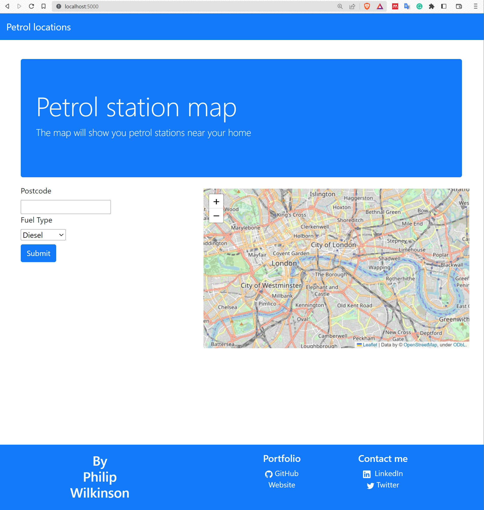
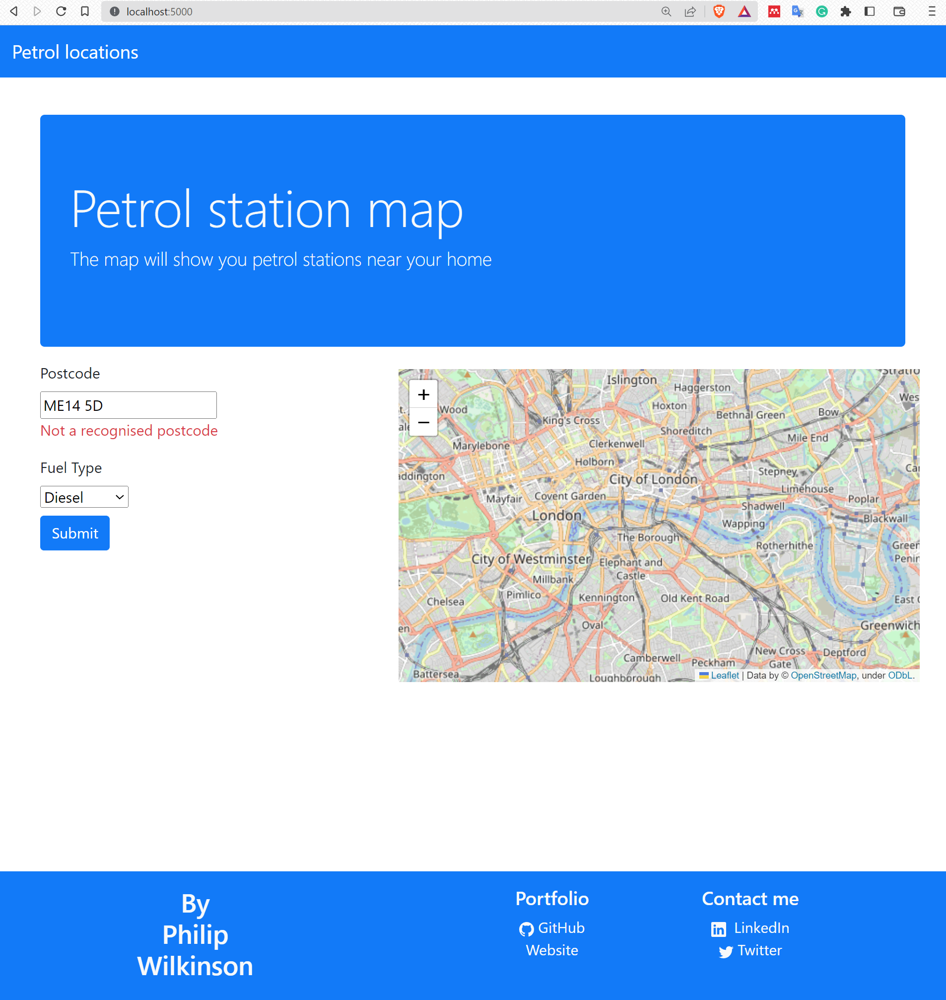
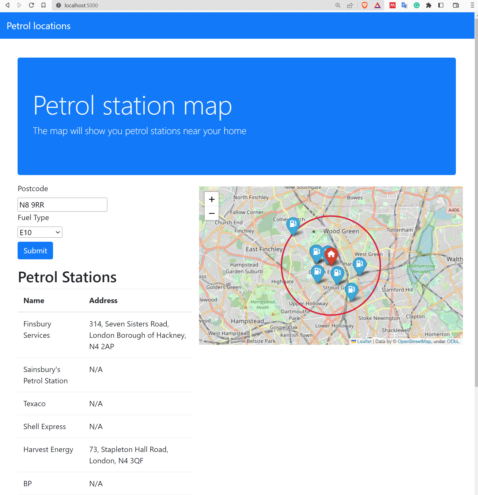

# Flask petrol map

## Initial setup

To setup the application to run on a new machine:

1. Create a virtual environment from the requirements.txt file
2. Copy `.env.template` to create an `.env` file and follow the 
instructions to create a secret key for the application along with
a bing maps API key.
3. In the command line run `flask run` to start up the 
application.
4. Navigate to `localhost:5000` and you should be able
to see the live application.

## Application purpose

The purpose of this application is for the user to enter their 
postcode and for the application to identify nearby 
petrol stations (within 2km). These petrol stations will be identified
by their name and address in a table and will also be
represented on a map to show which station may be closest
to the users home. 

## Application implemenetation 

### Input form

Users are expected to input their home postocde (or current location
postcode) and what fuel type they would like to search for. The Input
for this is handled by a Flask-wtform which deals with UK 
postcode validation and the selection of fuel type. 

### Map representation

A interactive map is generated using the folium application. This
is then passed to the user interface in the form of an IFrame 
object. The usage of a folium map object allows for the addition 
of interactive markers to show both the original home
location and the petrol stations.

### GoeCoding postcode

Geocoding the postcode is done using the BING API as integrated
into the Geopy Geocding module. The reason for this is that it is 
much more likely to retrieve a point location for a postcode
than the OSM API. It is also much cheaper than the Google Geocoding
API. This point then location can then be passed to the OSM API
to extract petrol stations nearby.

### Getting petrol stations

Petrol stations are identified using the "amenity:fuel" tag from 
OSM and the "fuel":type key as well. The OSM API is used, through
the `OSMNX` library as this is a freely available resource with 
no limits in terms of cost. For this the `geometries_from_point`
function is used, as opposed to the `geometries_from_address` function
because it is more reliable. As long as the postcode has been geocoded
correctly then it should be able to find local petrol stations.

### Mapping results

Results are mapped using the folium map object. This is done in three
main stages:
1. Petrol stations are mapped onto the folium map object with
markers
2. Home location is mapped onto the folium map object with a marker
3. A distance circle is created around the home location to 
show the distance boundary

## Application workflow

The user will interact primarily with the input form where they
input their postcode and fuel type. The application will then
load the folium map object showing the result.

The index page looks like:

Where on first load the user sees the jumbotron, the input form 
and an empty map.

The user will then input their postcode. The validation
of the postcode comes from the form which uses REGEX to determines
whether the postcode follows the expected format of the UK postcode:

If the postcode is recognsied then the service will then attempt
to geocode the postcode and find nearby petrol stations. If
petrol stations are found then the result will show on the map
along with a table showing the stations and their address:

## ToDo

There project can be extened in several different ways. The way 
in which the project is currently build would allow for the adaptation
towards finding other closest amenities in the future with a bit
of refactoring. However, Keeping in line with the petrol station
focus a few additions could inclide:

### Adding petrol station distance

At the moment the application simply returns the petrol station name
and address (if address is available). The user however is likely to 
want to know which of these stations is closer. The application 
could thus be extended to allow for the calculation of distance 
between the home loctaion and each petrol station, with an additional
column added to the table to show distance.

### Getting petrol station address

At the moment the address for the petrol station depends on the 
response from the OSM API. This can lead to missing information
on the petrol station address even though it has geocordinates
to say where it is. The application could thus be extended to 
make this search more robust.

### Deploying application

At the moment the application needs to be deployed on individuals
machines rather than being available to all users. It would be useful
to deploy this application somewhere in the future. This could include
deployment on an AWS lightsail instance of a Lambda service.

### Adding Google Maps link

In addition to making the addresses more robuts, it would be beneficial
for the user to be able to generate routes to the destination. This could 
be integrated through a google maps link on each address. This would 
allow the user to take advantage of google maps to find a route to the 
nearest or most appropriate destination.